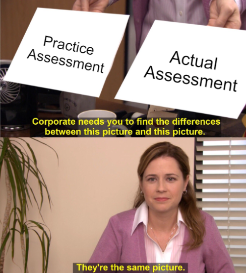

# W14 Study Guide

## React Router

- Know how to use `createBrowserRouter` and `RouterProvider`
- Know how to define a dynamic route
- Know how to create a Layout component
- Know how to use an `Outlet` component
- Know how to use `NavLink` and `Link`
- Know how to create a splat route: `*`
- Know how to use the `useParams` hook
- Know how to use `useNavigate` to programatically change pages

## React

- Know how to pass props and receive props in components
- Know how to create a controlled `form` with dynamic validations (sorry, can't use the browser based form validations 🤷‍♂️)
  - This will require `useState` and `useEffect`
  - Setting form values and setting error validations as needed.
  - Know how to use `labels`, `inputs`, and `buttons` with `forms`.
  - Know how to disable a form submit button conditionally.
  - Know common `form` input types like `text`, `select` and `radio`
- Given an array of objects, know how to map over the array in the JSX block of a function component
- Know how to declare a class on a JSX element: `className="somthing"`

## What We Haven't Covered Yet
- React Context

We'll cover this on Friday 👍

## What should I Study?

**The Practice Assessment!!**

