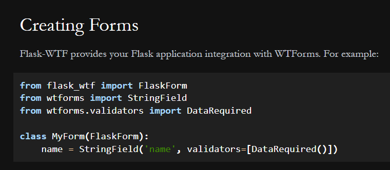
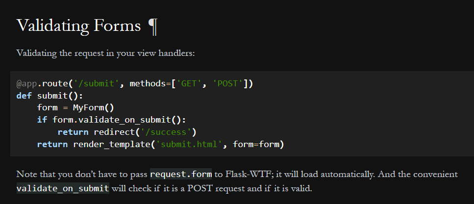
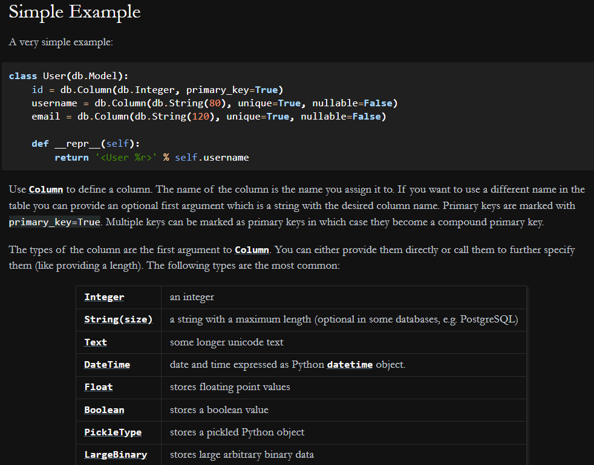
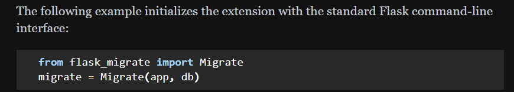

# Python Server Cheatsheet

## Install dependencies
Either type out all of the names in a single line:
`pipenv install flask pytest flask-sqlalchemy` etc..

Or, a better approach is to copy the list of dependencies into a .txt file, and then run the below:
`pipenv install -r requirements.txt`


## All the imports
```python

from flask import Flask, render_template, redirect
from flask_sqlalchemy import SQLAlchemy
from .models import db, ModelName
from .config import Configuration  # assuming you have a class called Configuration in a file called config.py
from .forms import FormName # assuming you have a form class called FormName in a file called forms.py
from flask_migrate import Migrate
from flask_wtf import FlaskForm
from wtforms import SomeField
from wtforms.validators import SomeValidator
```
## Forms

https://flask.palletsprojects.com/en/2.3.x/patterns/wtforms/ ⭐

Basic / layout and form template:

https://flask-wtf.readthedocs.io/en/1.2.x/quickstart/#creating-forms



Fields:

https://wtforms.readthedocs.io/en/2.3.x/fields/#basic-fields
Validating form in a route handler:

https://wtforms.readthedocs.io/en/2.3.x/fields/#basic-fields




## Models

https://flask-sqlalchemy.palletsprojects.com/en/2.x/models/#simple-example




## Route Views

DB querying:
https://flask-sqlalchemy.palletsprojects.com/en/2.x/queries/


Filtering:
https://flask-sqlalchemy.palletsprojects.com/en/2.x/queries/#querying-records
## Using Flask-Migrate


https://flask-migrate.readthedocs.io/en/latest/#command-reference
